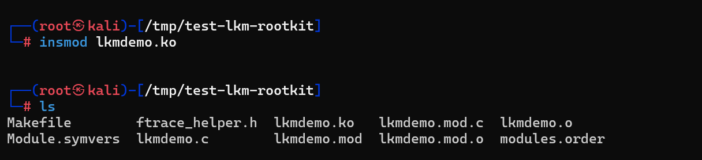
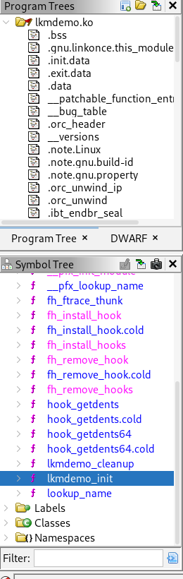
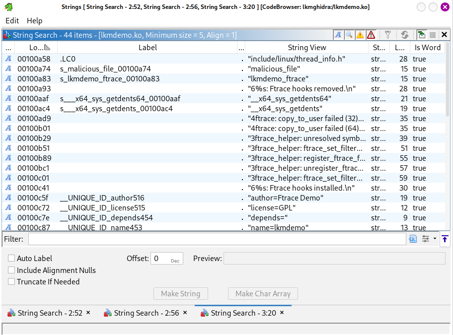
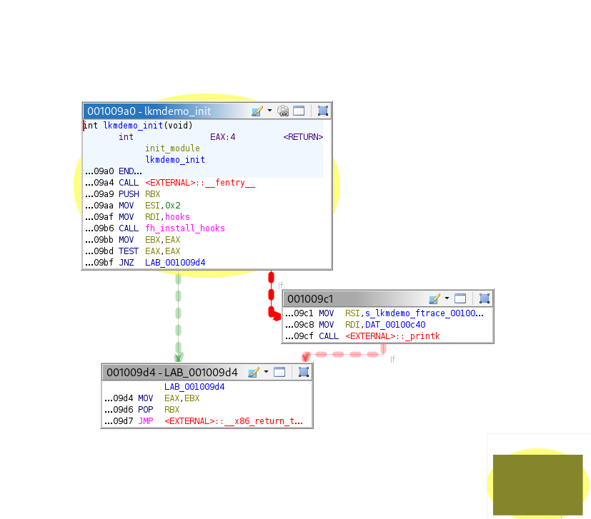
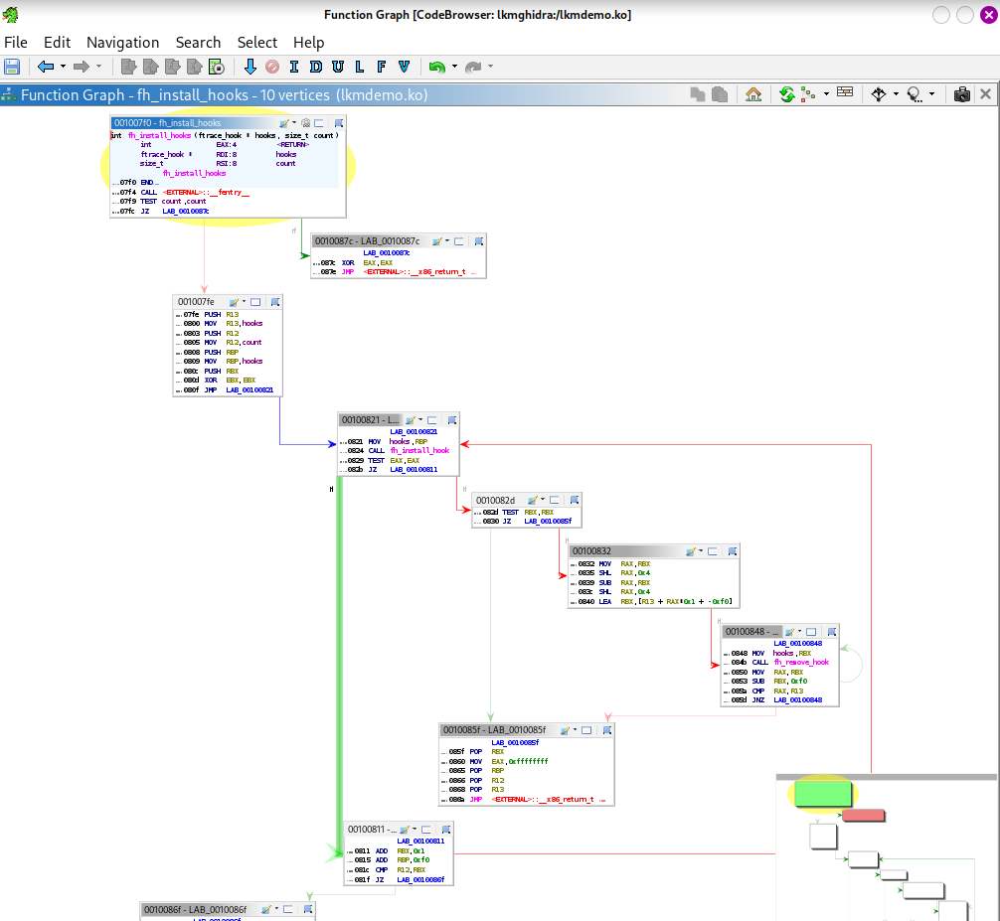

# Linux LKM File Hiding — Reverse Engineering with Ghidra

> **Unknown kernel module → suspicious behavior → static analysis → understand what it does**

A small reverse-engineering project focused on investigating a Linux Loadable Kernel Module (LKM) that hides selected files from normal directory listings.

**System:** Kali Linux
**Kernel:** `6.12.33+kali-amd64`
**Architecture:** `x86_64`
**Main tool:** Ghidra
**Hooking technique:** ftrace

---

## About

The investigation started with an **unknown kernel module** running in a controlled Linux lab.

The module was not trusted, so instead of assuming what it did, the goal was to **reverse engineer the compiled `.ko` file and understand its behavior**.

During testing, a file with a name starting with:

```text
malicious_file
```

was no longer visible through normal directory-listing tools.

For example:

```bash
ls -la /tmp/test-lkm-rootkit
```

NOTE :  `ls` is only an example. The important part is the **directory-entry data returned to userspace**, not the specific command used to display it.

The investigation asked:

> **Is the file actually deleted, or is the kernel module filtering it from the directory-listing result?**

---

## Investigation Flow

```text
Unknown LKM
    ↓
Observe suspicious behavior
    ↓
Collect the .ko file
    ↓
Open it in Ghidra
    ↓
Find strings and symbols
    ↓
Follow cross-references
    ↓
Identify ftrace hook
    ↓
Trace directory-entry handling
    ↓
Find filename comparison
    ↓
Understand the filtering logic
    ↓
Compare with runtime behavior
```

---

## How It Works

The sample uses **ftrace-based hooking** to intercept the relevant kernel functions.

The basic idea is:

```text
Userspace directory listing
          ↓
   Kernel directory path
          ↓
      ftrace hook
          ↓
   Directory entries
          ↓
    Filename check
          ↓
"malicious_file" match?
       /          \
     yes           no
      ↓             ↓
   filter         keep
   entry           entry
```

The important distinction is:

```text
Hidden from directory listing
            ≠
       File deleted
```

The filesystem object may still exist even though it is not returned through the normal directory-enumeration path.

---

## Why Modern Linux?

This project was tested on:

```text
Linux 6.12.33+kali-amd64
```

Modern Linux kernels have changed significantly compared with older kernels.

Traditional techniques such as direct system-call table modification are less practical on many modern systems because of kernel changes and hardening.

This makes **ftrace-based function hooking** an interesting technique to study when analyzing suspicious kernel modules.

The exact functions and implementation can also change between kernel versions, so the analysis is tied to the tested environment.

---

## Lab Environment

| Component           | Details              |
| ------------------- | -------------------- |
| OS                  | Kali Linux           |
| Kernel              | `6.12.33+kali-amd64` |
| Architecture        | `x86_64`             |
| Compiler            | GCC                  |
| Build               | GNU Make             |
| Reverse Engineering | Ghidra               |
| Module tools        | kmod                 |

The experiment was performed in an isolated lab environment.

---

## Project Structure

```text
lkm-rootkit-reverse-engineering/
├── README.md
├── ftracer/
│   └── ftrace_helper.h
├── lkmdemo/
│   ├── lkmdemo.c
│   ├── Makefile
│   └── lkmdemo.ko
├── screenshots/
│   ├── ghidra-symbols.png
│   ├── suspicious-module.png
│   ├── strings.png
│   ├── function-graph.png
│   └── hook-getdents64.png
└── .gitignore
```

---

# 1. Initial Observation

The investigation started with an unknown `.ko` module running in the lab.

A test directory contained:

```text
normal_file.txt
malicious_file_test
another_file.txt
```

A normal directory-listing command was used to check the contents.

```bash
ls -la /tmp/test-lkm-rootkit
```

The matching file was visible during the baseline test.

After the module's behavior was active, the matching entry was no longer shown.



At this point, the cause was unknown.

Possible explanations included:

* the file was deleted;
* the file was renamed;
* the directory was modified;
* or the kernel module was filtering the directory entry.

The next step was to investigate the module itself.

---

# 2. Reverse Engineering with Ghidra

The compiled module:

```text
lkmdemo.ko
```

was imported into Ghidra as an ELF object.

The analysis focused on:

* symbols;
* strings;
* cross-references;
* functions;
* control flow;
* ftrace-related code;
* directory-entry handling.

---

## Symbols

The symbol list was used to find functions related to module initialization, cleanup, hooking, and directory processing.



---

## Strings

A useful string found in the module was:

```text
malicious_file
```

Other useful indicators included references related to:

```text
getdents
getdents64
ftrace
```



The string alone does not prove the behavior.

Its cross-references were followed to see how the code actually uses it.

---

## Function Graph

The function graph was used to follow the control flow from the hook setup to the filtering logic.



The important path was:

```text
ftrace setup
     ↓
hooked function
     ↓
directory entries
     ↓
filename check
     ↓
filter / keep entry
```

---

## Hook Analysis

The sample configures ftrace hooks for:

```text
__x64_sys_getdents
__x64_sys_getdents64
```

These functions are part of the directory-entry system-call path on the tested x86-64 system.

The important point is that the module is **not hooking the `ls` command itself**.

Instead:

```text
ls / another userspace tool
            ↓
directory enumeration
            ↓
kernel
            ↓
getdents / getdents64
            ↓
ftrace hook
            ↓
filtering logic
```

This means other userspace programs using the same directory-enumeration interface may also be affected.



---

# 3. Reconstructed Behavior

After following the relevant code in Ghidra, the behavior can be summarized as:

```text
Directory entries returned
          ↓
      Read filename
          ↓
Compare filename with filter
          ↓
Starts with "malicious_file"?
       /          \
     yes           no
      ↓             ↓
remove entry     keep entry
```

The runtime behavior matched this model.

---

# Findings

| Finding                  | Result                                          |
| ------------------------ | ----------------------------------------------- |
| Unknown module           | `lkmdemo.ko`                                    |
| Target                   | Directory entries                               |
| Filename filter          | `malicious_file*`                               |
| Hooking method           | ftrace                                          |
| Relevant path            | `getdents` / `getdents64`                       |
| Reverse-engineering tool | Ghidra                                          |
| File deletion            | Not required for the hiding behavior            |
| Runtime result           | Matching entries disappear from normal listings |

---

# Defensive Relevance

This project shows how an unknown kernel module can change what userspace sees.

A missing file in a normal directory listing should therefore not immediately be treated as proof of deletion.

When investigating suspicious kernel activity, defenders can examine:

* loaded kernel modules;
* unexpected `.ko` files;
* module metadata;
* ftrace activity;
* kernel logs;
* filesystem evidence;
* endpoint telemetry.

The important idea is:

```text
What userspace sees
        ↓
may not always equal
        ↓
what actually exists
```

---

# Building

Install the required packages:

```bash
sudo apt install -y build-essential libncurses-dev linux-headers-$(uname -r)
```

Build the module:

```bash
cd lkmdemo
make
```

The build produces:

```text
lkmdemo.ko
```

The module should be built and tested only in an isolated, authorized environment.

---

# Limitations

This project was tested on:

```text
Kali Linux
Linux 6.12.33+kali-amd64
x86_64
```

Kernel internals can change between versions, so the same analysis may produce different results on another kernel.

The filename filter is also intentionally simple:

```text
malicious_file*
```

The goal is to demonstrate **reverse engineering and investigation**, not to create a production rootkit.

---

# Disclaimer

This project is for educational, defensive, and authorized cybersecurity research.

Kernel modules run with high privileges and can crash or destabilize a system.

Use an isolated lab or virtual machine and never test kernel-level techniques on systems without permission.

---

# Final Takeaway

The main lesson is not the hiding technique itself.

It is the investigation process:

```text
Unknown module
      ↓
Suspicious behavior
      ↓
Collect the artifact
      ↓
Reverse engineer with Ghidra
      ↓
Find the hook
      ↓
Trace the code
      ↓
Understand the behavior
      ↓
Validate the result
```

This is a practical workflow for analyzing suspicious Linux kernel modules and understanding what they actually do.
